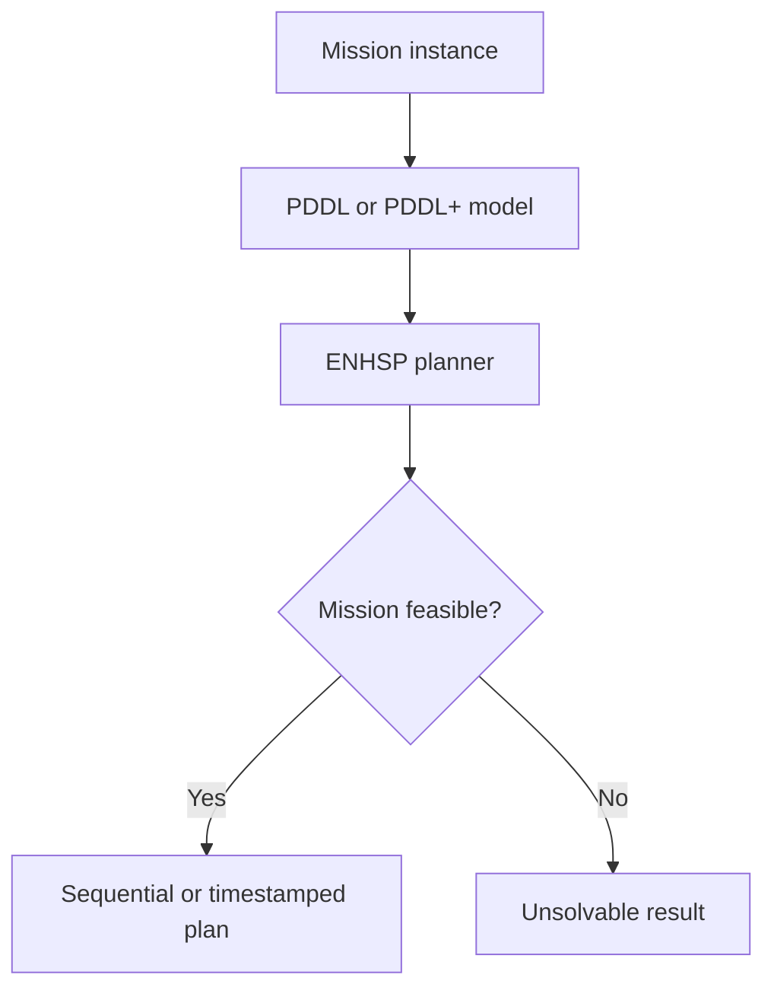
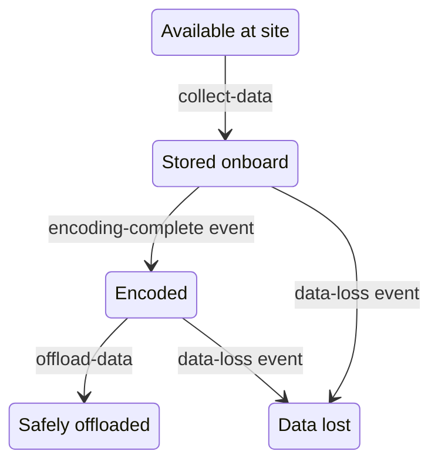

<div align="center">

# Planetary Rover Planning Under Memory and Data-Loss Constraints

**Symbolic mission planning with classical PDDL, PDDL+, numeric resources, continuous processes, and autonomous events.**

<p>
  
  
  
  
</p>

**[Generated Plans](plans/)**

</div>

---

## Overview

This project models an autonomous planetary rover that must navigate a known environment, collect scientific datasets, manage limited onboard memory, and return data safely to a base station.

The first model uses **classical PDDL with numeric fluents** to represent memory capacity, dataset sizes, collection, navigation, and offloading. The second model extends the mission with **PDDL+ processes and events**, introducing continuous data encoding, continuous corruption, automatic encoding completion, and automatic data loss.

The experiments demonstrate an important planning result: a mission can be spatially reachable and have sufficient storage, yet remain impossible because critical data degrades before it can be encoded and offloaded.

## Project Highlights

| Capability | Implementation |
| --- | --- |
| Symbolic mission planning | Typed PDDL domains with reusable actions and predicates |
| Resource reasoning | Numeric fluents track memory capacity, occupancy, and dataset size |
| Capacity-aware behaviour | Collection is permitted only when the new data fits onboard |
| Continuous dynamics | Encoding progress and corruption evolve while data is stored |
| Autonomous state changes | PDDL+ events mark data as encoded or irrecoverably lost |
| Feasibility analysis | Deliberately solvable and unsolvable missions validate the model |
| Reproducibility | Domain files, problem instances, plan summaries, and raw solver output are included |

## Planning Pipeline



The project uses [ENHSP](https://sites.google.com/view/enhsp/), an expressive numeric heuristic-search planner supporting classical and numeric PDDL as well as PDDL+ processes and events.

## Data Lifecycle



While a dataset is stored, encoding and corruption evolve concurrently. Reaching the encoding threshold makes the dataset eligible for offloading, while reaching the corruption limit before offloading triggers data loss.

## Model Comparison

| Feature | Classical PDDL | PDDL+ extension |
| --- | ---: | ---: |
| Rover navigation | ✓ | ✓ |
| Data collection and offloading | ✓ | ✓ |
| Numeric memory capacity | ✓ | ✓ |
| Dataset-specific storage size | ✓ | ✓ |
| Continuous encoding | - | ✓ |
| Continuous corruption | - | ✓ |
| Automatic encoding completion | - | ✓ |
| Automatic data loss | - | ✓ |
| Timing-dependent feasibility | - | ✓ |

## Classical PDDL Model

The classical domain defines three actions:

- `move` - transfers the rover between connected locations;
- `collect-data` - collects and stores a dataset when sufficient memory is available;
- `offload-data` - transfers stored data at the base and frees onboard memory.

Memory is represented through numeric fluents:

```lisp
(used-memory ?r - rover)
(memory-capacity ?r - rover)
(data-size ?d - data)
```

The capacity precondition ensures that a collection action never exceeds the rover's available storage:

```lisp
(>=
  (memory-capacity ?r)
  (+ (used-memory ?r) (data-size ?d))
)
```

In mathematical form:

```text
used memory + incoming dataset size <= memory capacity
```

The constrained instance contains datasets of sizes `4`, `4`, `10`, and `6` with a rover capacity of `10`. This forces the planner to reason about exact filling, solo transport, partial offloading, and reuse of freed memory.

## PDDL+ Extension

The extended domain adds continuous processes for data encoding and corruption:

```lisp
(:process data-encoding ...)
(:process memory-corruption ...)
```

Their numeric effects depend on elapsed time:

```lisp
(increase
  (encoding-progress ?d)
  (* #t (encoding-rate ?d))
)

(increase
  (corruption ?d)
  (* #t (corruption-rate ?d))
)
```

Two autonomous events handle threshold crossings:

- `encoding-complete` fires when encoding reaches the required value;
- `data-loss` fires when corruption reaches the dataset-specific limit.

For a dataset with constant rates, the idealized threshold times are:

```text
encoding time = remaining encoding requirement / encoding rate
loss time     = remaining corruption margin / corruption rate
```

A dataset is temporally feasible only when encoding can complete before its corruption limit is reached.

## Experimental Scenarios

| Scenario | Model | Main constraint | Result |
| --- | --- | --- | --- |
| Problem 1 | PDDL | Basic collection and offloading | **Solved** |
| Problem 2 | PDDL | Capacity 10 with datasets of sizes 4, 4, 10, and 6 | **Solved** |
| Plus 1 | PDDL+ | Encoding completes before corruption | **Solved** |
| Plus 2 | PDDL+ | Data is corrupted before encoding completes | **Unsolvable** |
| Plus 3 | PDDL+ | Multiple datasets evolve concurrently at different rates | **Solved** |
| Plus 4 | PDDL+ | Two required datasets are temporally infeasible | **Unsolvable** |

The unsolvable cases are intentional experimental results, not execution errors. They confirm that the automatic data-loss event changes mission feasibility as designed.

## Repository Structure

```text
planetary-rover-pddl-planning/
├── pddl/
│   ├── domain-memory-rover.pddl
│   ├── problem-1-simple.pddl
│   └── problem-2-memory-constrained.pddl
├── pddl-plus/
│   ├── domain-memory-rover-plus.pddl
│   ├── problem-plus-1-safe.pddl
│   ├── problem-plus-2-data-loss.pddl
│   ├── problem-plus-3-multiple-data.pddl
│   └── problem-plus-4-multiple-failures.pddl
├── plans/
│   ├── raw/                         # Complete ENHSP output
│   └── *.txt                        # Clean plan summaries
└── README.md
```

## Requirements

- Java 17 or a compatible Java runtime
- [ENHSP](https://sites.google.com/view/enhsp/)
- Linux, macOS, or Windows through WSL

## Running the Experiments

Clone the repository and move into its root directory:

```bash
git clone https://github.com/egjinaj/planetary-rover-pddl-planning.git
cd planetary-rover-pddl-planning
```

Set the path to your ENHSP JAR file:

```bash
export ENHSP_JAR=/absolute/path/to/enhsp.jar
```

### Classical memory-constrained mission

```bash
java -jar "$ENHSP_JAR" \
  -o pddl/domain-memory-rover.pddl \
  -f pddl/problem-2-memory-constrained.pddl \
  -planner opt-hrmax
```

### PDDL+ safe mission

```bash
java -jar "$ENHSP_JAR" \
  -o pddl-plus/domain-memory-rover-plus.pddl \
  -f pddl-plus/problem-plus-1-safe.pddl
```

### PDDL+ data-loss mission

```bash
java -jar "$ENHSP_JAR" \
  -o pddl-plus/domain-memory-rover-plus.pddl \
  -f pddl-plus/problem-plus-2-data-loss.pddl
```

The same domain can be combined with either of the remaining PDDL+ problem files to reproduce the multi-data and multiple-failure experiments.

To preserve the complete solver output:

```bash
java -jar "$ENHSP_JAR" \
  -o pddl-plus/domain-memory-rover-plus.pddl \
  -f pddl-plus/problem-plus-3-multiple-data.pddl \
  > plans/raw/multiple-data-output.txt
```

> ENHSP evaluates autonomous PDDL+ processes using its configured time discretization. Results should therefore be interpreted within the solver configuration used for the experiment.

## Design Decisions

- **Numeric fluents instead of Boolean memory states** preserve partial occupancy and exact capacity reasoning.
- **Processes instead of actions** represent encoding and corruption as autonomous continuous behaviour.
- **Events instead of rover commands** model threshold-triggered state changes that occur automatically.
- **Dataset-specific rates and limits** create meaningful differences in urgency and feasibility.
- **Solved and unsolvable instances** test both successful planning and correct rejection of impossible missions.
- **A simple navigation topology** isolates memory and temporal reasoning from geometric path-planning complexity.

## Scope and Limitations

The model focuses on high-level task planning rather than physical rover simulation. It does not currently represent:

- geometric motion planning or obstacle avoidance;
- travel duration and terrain-dependent movement cost;
- battery or energy consumption;
- communication bandwidth and offloading duration;
- probabilistic corruption or uncertain data sizes;
- compression, storage fragmentation, or low-level file systems;
- multiple coordinated rovers.

Movement is instantaneous in the current PDDL+ abstraction. Consequently, corruption and encoding evolve during planner-generated waiting periods rather than during realistic travel durations.

## Potential Extensions

- Add durative movement with terrain-dependent travel time
- Model energy consumption and charging constraints
- Add communication windows and bounded transmission rates
- Introduce probabilistic data degradation
- Extend the domain to multiple cooperating rovers
- Optimize mission duration, energy use, or scientific value
- Integrate the symbolic plan with a ROS 2 execution layer

## Project Files

- [Classical PDDL models](pddl/)
- [PDDL+ models](pddl-plus/)
- [Generated plan summaries](plans/)
- [Raw ENHSP solver output](plans/raw/)

## Author

**Endri Gjinaj**  
MSc Robotics Engineering student, University of Genoa  
[GitHub Profile](https://github.com/egjinaj)

---

<div align="center">
  <sub>Developed to explore numeric, temporal, and hybrid planning for autonomous robotic missions.</sub>
</div>
